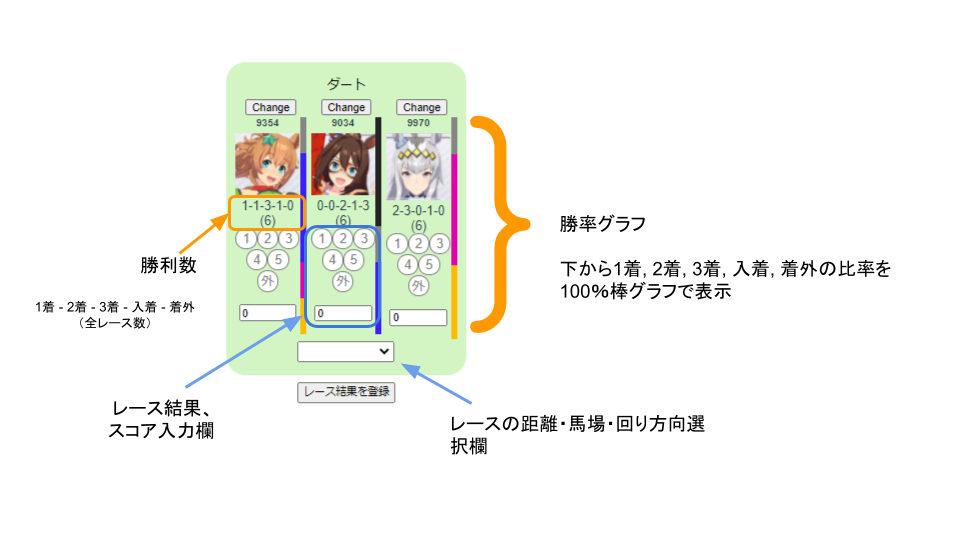
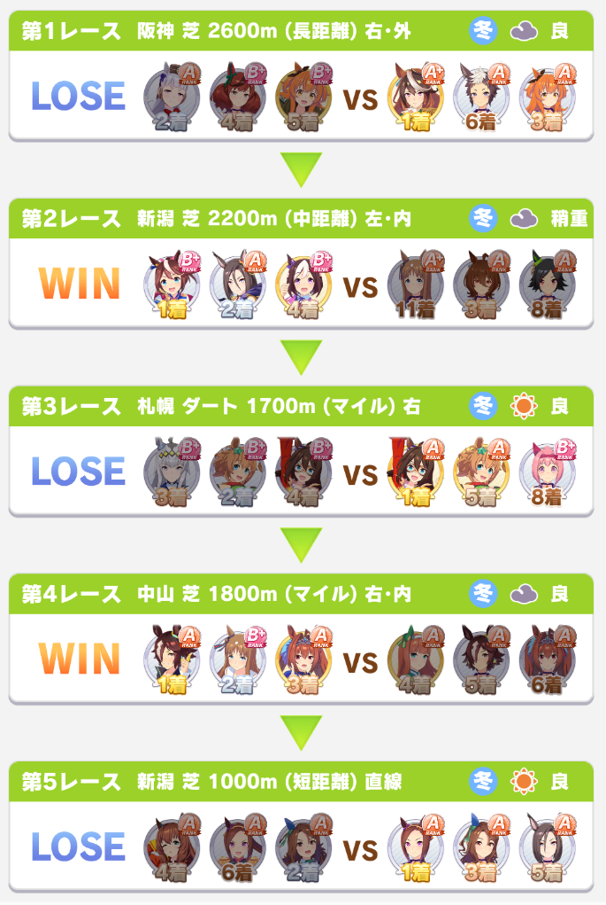

# ウマ娘チームレース履歴集計

ウマ娘のチームレースでの入着履歴を記録するWeb Appです。
こちらの[リンク先](https://ixsiid.github.io/TeamHistory)から利用できます。

レース毎に手動で入力する必要がありますが、下図のように今までの入着履歴を集計できます。

## スクリーンショット貼り付けでの入力
ペースト欄に次のようなスクリーンショットを貼り付けることで画像認識がうまくいけば自動で入力されます。

ウィンドウサイズによっては上手くいかないかもしれません。
状況・環境を合わせてIssuesを上げてもらえると助かります。

# 注意事項
データの保存はLocalStorage（ブラウザ上のキャッシュのようなもの）に保管しています。
ブラウザの挙動によって、不意に削除されることがありますので、定期的に現在のデータをダウンロードして保管してください。

# ToDo
- 各種グラフ表示
  - 今までの履歴のグラフ表示
  - 距離毎の結果表示
  - スコアの分布表示

# 出来たらいいなぁ
全レース結果表示画面から入力内容の自動生成

# 更新履歴メモ
- チーム勝率を表示
- スクショでの入力に対応（ベータ）
- 登録ウマ娘のフィルタ
