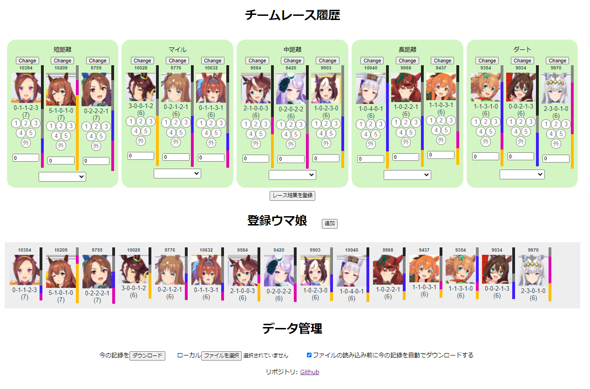

# ウマ娘チームレース履歴集計

ウマ娘のチームレースでの入着履歴を記録するWeb Appです。
こちらの[リンク先](https://ixsiid.github.io/TeamHistory)から利用できます。

レース毎に手動で入力する必要がありますが、下図のように今までの入着履歴を集計できます。

# 注意事項
データの保存はLocalStorage（ブラウザ上のキャッシュのようなもの）に保管しています。
ブラウザの挙動によって、不意に削除されることがありますので、定期的に現在のデータをダウンロードして保管してください。

# ToDo
- 各種グラフ表示
  - 今までの履歴のグラフ表示
  - 距離毎の結果表示
  - スコアの分布表示

# 出来たらいいなぁ
全レース結果表示画面から入力内容の自動生成

# お願い
レース候補は育成シナリオのレース一覧をもとに作成していますが、
チームレース専用のコースがあるようです。
候補にないものがあったら Issues からご連絡ください。
